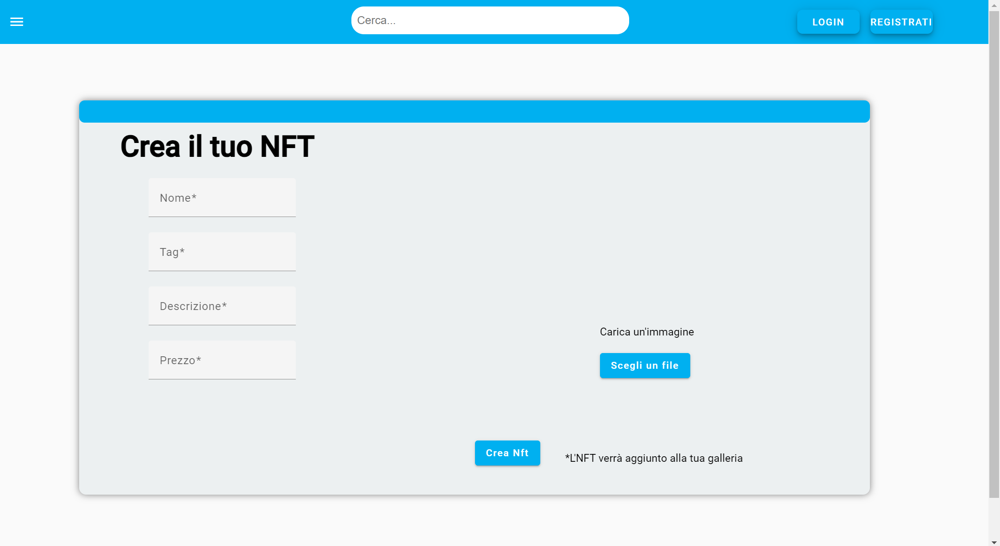
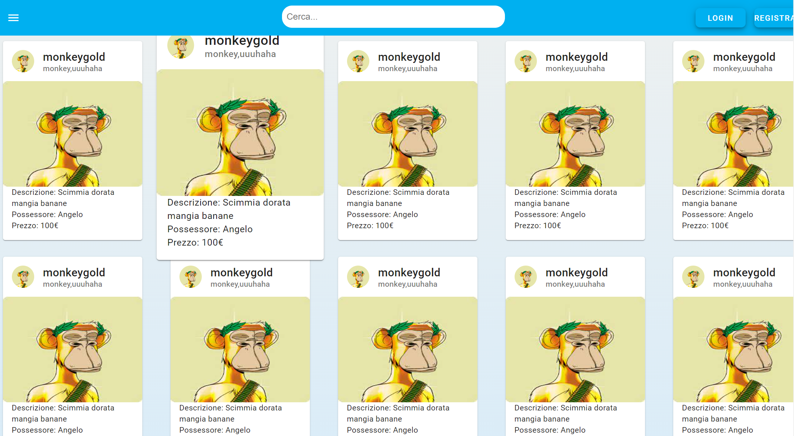

## Frontend

### Refresh Page for Updates
- After adding a wallet on the user info page.
- After logging in with an account or purchasing an NFT to update the user rank displayed in the top-left corner of the home bar.

### Wallet Requirement
- Always include a wallet for selling, buying, or bidding on an NFT.

### Password Requirement
- Always enter the password when modifying account information on the user info page.

### Auction Duration Format
- Follow the pattern `hh:mm:ss` for entering auction duration (e.g., `02:36:02` for an auction lasting 2 hours, 36 minutes, and 2 seconds).

### Screenshots

*NFT creation interface.*

*List of available NFTs.*
